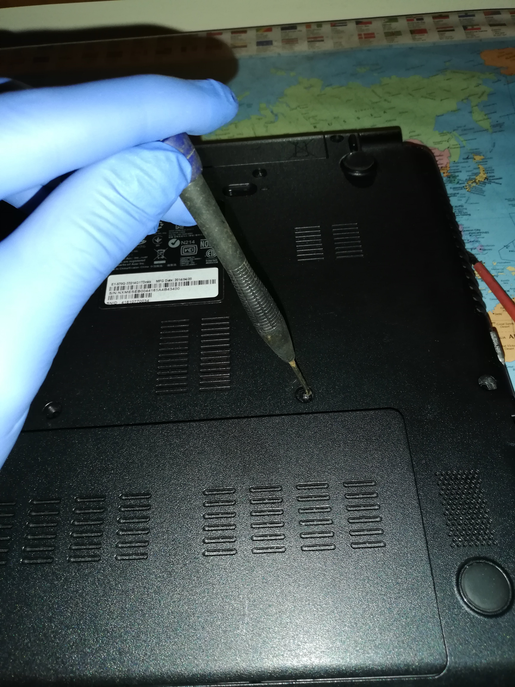

# Acer-E1-570G

In order to refurbish my 5yrs old acer I decided to install the newwest version of ubuntu and make a general cleaning and thermal paste replacement. Ifixit considered this operation dificult for a similar model. 

## Ubuntu 20.04 LTS instalation
I performed the change from Windows to Ubuntu using a USB stick flashed using etcher. Full details in the links below. 

- **windows** https://ubuntu.com/tutorials/tutorial-create-a-usb-stick-on-windows#1-overview
- **linux** https://www.makeuseof.com/tag/install-ubuntu-computer-using-usb-flash-drive/

## Thermal paste replacements
Since the ifixit link does not cover my laptop model, I covered my replacement in the next pictures.

**1st step - remove disk and memory cover**

**2nd step - remove disk and memory**

**3rd step - remove cd tray**

**4th step - remove battery. move to right**

**5th step - remove flats and connections **

**6th step - remove antena**

**7th step - remove and clean mother board **

**8th step - remove and clean fan**

**9th step - remove heat pipes - remove old thermal paste**

**10th step - apply paste. bigger conductivity better**

**11th step  put everything together without missing screws**

